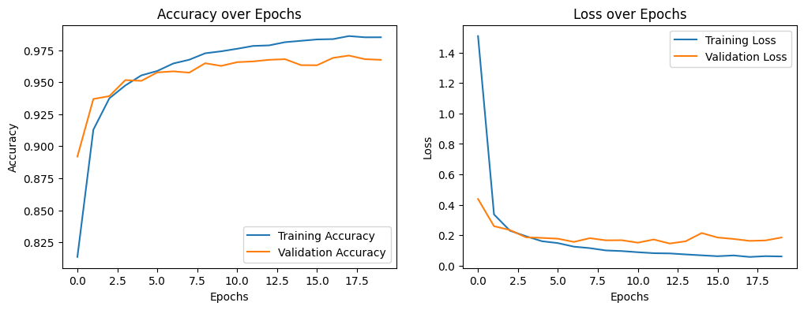

# **MNIST-MLP-Classifier**

This project implements a **Multilayer Perceptron (MLP)** to classify handwritten digits from the **MNIST dataset**. It demonstrates a complete deep learning workflow, including:

- Loading and preprocessing data

- Designing and implementing a neural network

- Training, validating, and evaluating the model

- Visualizing performance metrics and predictions

The project uses **Python** and **TensorFlow/Keras**, providing a clear and reproducible example of image classification with neural networks.

## **Motivation**

Handwritten digit recognition is a classic problem in machine learning and is an excellent introduction to neural networks and image classification.
The MNIST dataset provides a standardized benchmark, allowing experimentation with model architectures, preprocessing techniques, and evaluation metrics.

This project was designed to showcase a complete end-to-end workflow, from data preprocessing to model training, evaluation, and visualization of results.
It helps illustrate key concepts in deep learning including activation functions, loss functions, optimization, and model performance analysis.

## **Dataset**

This project uses the **MNIST Handwritten Digits Dataset**.

- Total samples: 70,000 images
  - 60,000 for training
  - 10,000 for testing
- Image size: 28 × 28 pixels
- Channels: Grayscale (1 channel)
- Number of classes: 10 (digits 0 through 9)
- Format: Single-channel 2D images flattened into
  784-dimensional vectors for MLP input
- Label type: Integer class labels (0–9)

## **Data Preprocessing**

Since MNIST is a clean and well-structured dataset, the preprocessing steps focus on preparing the images for efficient training and helping the MLP converge faster.

The dataset is loaded directly using Keras utilities.
This gives:

- Training set: **60,000 images**
- Test set: **10,000 images**
- Each image: **28×28 pixels**, grayscale

To stabilize gradients and help the optimizer converge more smoothly, the training images are standardized. Standardization is preferred over simple min–max scaling here because:

- MNIST images have a predictable pixel distribution (digits on dark backgrounds).
- Neural networks train more effectively when inputs have **zero mean** and **unit variance**.

Since the MLP uses dense layers, images must be flattened from `28×28` into vectors of **784 features**.  
Flattening is performed inside the model's first layer. This keeps preprocessing minimal and shifts shape management into the model itself.

Instead of manually separating a validation set, the model automatically uses **20% of the training data** as validation during training. This provides:

- consistent validation metrics
- no extra dataset handling
- less code complexity

## **Model Architecture**

The model is designed as a **fully connected Multilayer Perceptron (MLP)** built using TensorFlow/Keras. It focuses on balancing simplicity, interpretability, and strong baseline performance on MNIST.

### **Architectural Overview**

The network consists of:

1. **Flatten Layer** – reshapes 28×28 images into 784-dimensional vectors
2. **Dense Layer (128 units, ReLU)** – first hidden layer
3. **Dense Layer (64 units, ReLU)** – second hidden layer
4. **Dense Layer (10 units, Softmax)** – output layer for digits 0–9

## **Design Rationale**

### **1. Use of a Flatten Layer**

The MNIST images are kept in their original 28×28 shape until they reach the model.  
Flattening inside the model:

- keeps preprocessing simple
- makes the architecture self-contained
- ensures shape consistency during inference

### **2. Two Hidden Layers (128 → 64 units)**

This architecture was chosen because it provides a strong baseline for MNIST without unnecessary complexity:

- **128 units** capture high-level pixel interactions
- **64 units** encourage feature compression and reduce overfitting risk
- The combination balances accuracy and training speed

This layout is widely used in introductory neural network research.

### **3. ReLU Activation**

ReLU (`max(0, x)`) is used for all hidden layers because it:

- accelerates convergence compared to sigmoid
- reduces issues related to vanishing gradients
- performs extremely well on pixel-based tasks

### **4. Softmax Output Layer**

The final layer uses `softmax` with 10 units, producing a probability distribution across digit classes. This is the standard choice for multiclass classification.

### **5. Adam Optimizer + Sparse Categorical Crossentropy**

- **Adam** was chosen because it adapts learning rates dynamically and performs reliably across many datasets.
- **Sparse categorical crossentropy** allows labels to remain integers (0–9), simplifying preprocessing.

## **Model Training**

The training process focuses on building a clean and reproducible pipeline using TensorFlow/Keras. The model is trained on the standardized MNIST images for 20 epochs, with automatic validation to monitor overfitting and generalization.

### **Key Hyperparameters**

- **Epochs:** 20
  - Long enough for stable learning
  - Short enough to avoid unnecessary computation
- **Validation Split:** 0.2
  - 20% of training data is reserved as validation
  - Allows monitoring accuracy/loss during training
- **Optimizer:** Adam
  - Adaptive learning rate
  - Performs well on image-based tasks
- **Loss Function:** Sparse Categorical Crossentropy
  - Suitable for integer labels (0–9)
- **Batch Size:** Uses Keras default (32), which offers stable gradient estimates

### **Overfitting Monitoring**

Overfitting was tracked using:

- **Training vs. validation accuracy curves**
- **Training vs. validation loss curves**

**Observation:**

- Training and validation accuracy follow similar trends
- Loss decreases steadily for both sets
- No severe overfitting appears within 20 epochs
- Model shows strong generalization to unseen data

## **Training Curves**

### **Accuracy and Loss Over Epochs**

## **Results**

The final model demonstrates strong performance on the MNIST digit-classification task, achieving **high accuracy** and **stable generalization** despite using a simple MLP architecture rather than convolutional layers.

### **Final Evaluation Metrics**

| Metric                 | Value                          |
| ---------------------- | ------------------------------ |
| **Test Accuracy**      | ~0.97–0.98                     |
| **Test Loss**          | Printed during evaluation      |
| **Evaluation Dataset** | 10,000 unseen grayscale images |

The model reaches **97–98% accuracy**, which is a strong result for a fully connected network trained without regularization, data augmentation, or advanced tuning techniques.
